Microservices with Eureka on Oracle Application Container Cloud
===============================================================

The [Oracle Application Container Cloud Service](http://cloud.oracle.com/acc) (ACCS) is a polyglot application platform designed to support cloud native application deployment.  It has great support for applications that follow the [12 Factor app](http://12factor.net) cloud native principals like separation of configuration from code, a stateless process model, and the ability to elastically scale out and in by adding and removing application instances.  Recently, ACCS improved its support for microservice-style applications by adding overlay networking so that: a) application instances can communicate with their peers to support clustering, and b) applications can collaborate and provide services to each other.  The later is a core enabler of a microservices architecture.  Using the ACCS [overlay networking](https://en.wikipedia.org/wiki/Overlay_network) support applications can communicate directly over a private IP network.

To demonstrate this new functionality, I’ve taken an existing [Spring Cloud microservices example](https://spring.io/blog/2015/07/14/microservices-with-spring) and deployed it to ACCS. The example was originally designed to run locally on a desktop so the few changes I made were mostly to the configuration removing things like hardwired references to `localhost`. The example is comprised of three ACCS applications: a Web service, an Accounts service, and a [Netflix/Spring Cloud Eureka](https://cloud.spring.io/spring-cloud-netflix/) [Service Registry](http://microservices.io/patterns/service-registry.html) that applications use to locate each other.  Clients interact with the Web application which obtains account information from the backing Accounts applicattin which in turn manages data in a database.  The service registry is consulted by the Web application each time it needs an Account service.  The Service Registry is the only other application every other application needs to know.  Every other application can be found through the registry.

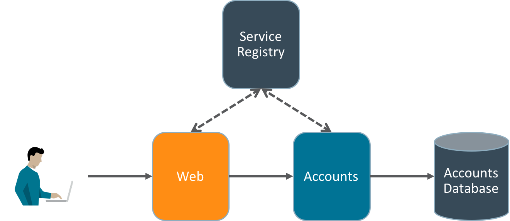

This is just an example so for simplicity the database is the in-memory H2 DB that’s embedded in the Accounts application.   Completing the picture is the ACCS load balancer which accepts all incoming HTTP traffic and distributes it across available instances of a given application.

With ACCS overlay networking enabled, the Web, Accounts, and Service Registry are all placed on a shared TCP/IP network so the Web application can connect directly to the Accounts application without going back out to the public internet and through the load balancer.  This obviously improves performance but it also makes it possible to expose APIs that are only accessible to other applications and not to external clients.  The ACCS load balancer currently only accepts incoming HTTP traffic on port 80, but applications can use any port and any protocol to communicate privately amongst themselves on the internal overlay network.

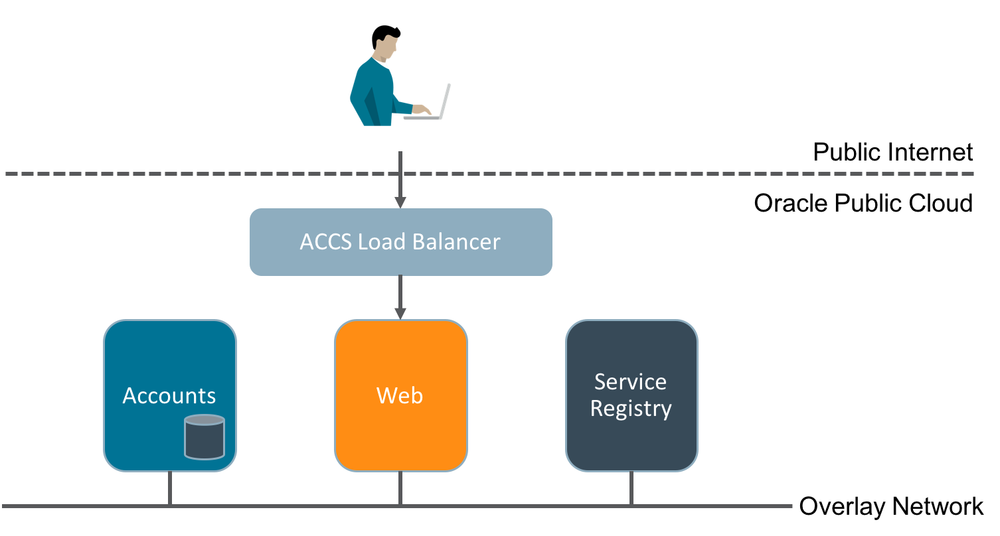

Application Container Cloud Network Basics
==========================================

To place an application on the overlay network, simply add `isClustered: true` to the application’s manifest.json.  For example:

    {
      "runtime": {
          "majorVersion": "8"
      },
      "command": "java -jar myapp.jar",
      "isClustered" : true
    }
    
If you have a clustered application and an instance needs to find it's peers, you can use the application name to lookup the IPs of all the application instances.  For convenience, the application name you specified at creation time is available in the `ORA_APP_NAME` environment variable.  In Java, for example, you could obtain a list of the application instances' addresses with the following lines of code:

    String APP_NAME = System.getenv("ORA_APP_NAME");
    InetAddress[] inetAddresses = InetAddress.getAllByName(APP_NAME);

To get the IPs of other applications you would also use their name as specified at creation time.

Deploying the example to ACCS using Stack Manager
=================================================

Now that we've laid out the basics of enabling network connectivity let's return to the example.  For simplicity the example build generates a single fat jar that contains all three services that you can select with an argument when you start up.  

Once you've cloned the source repository, cd into the top level folder and run `mvn clean package`.  This will produce a deployable application archive that includes the fat jar plus any scripts required to run on ACCS.

To run on ACCS you need to deploy the application archive along with an appropriate manifest.json and deployment.json.  This is straight forward but given we are deploying a set of related services, the best way to do this is with a [Stack Manager](http://docs.oracle.com/cloud/latest/stack-manager-cloud/index.html) template.  A template allows us to define a configuration (or a 'stack') with all three services and deploy them all in a single step.

A stack template also solves a problem I mentioned earlier on which is that every service needs to know how to reach the service registry.  I can name the registry service anything but I also need to make that name known to the other services and I don't want to hardwire it.  Fortunately stack templates support functions and variable references so we can provide individual service names when we create an instance of a stack and refer to those input parameters in the template. Here's the top of my stack template where I define input parameters for the names of the three services the stack template will create.  The names of the parameters are `serviceRegistryName`, `accountsServiceName`, and `webServiceName`.  In the template I can also provide descriptions and default values.

    parameters:
      serviceRegistryName:
        label: Service registry application name
        description: The name of the service registry application
        type: String
        mandatory: true
        default: registry
      accountsServiceName:
        label: Accounts service application name
        description: The name of the accounts application
        type: String
        mandatory: true
        default: accounts
      webServiceName:
        label: Web servcie application name
        description: The name of the web application
        type: String
        mandatory: true
        default: web

The next step is to define the three ACCS applications. The first is the registry. Under the `resources` object, I've defined a resource (in this case an ACCS application) with an internal template name `registry` of type `apaas` (Application Platform as a Service, AKA ACCS).  Notice that the resource takes a number of parameters to create it, including `name` which I've set to the value of the stack template `serviceRegistryName` parameter I'll have to provide later.  The manifest and deployment properties have the exact same function and structure as the standard manifest.json and deployment.json files.  The stack template let's us inline their contents as YAML.  Notice the inclusion of `isClustered: true` in the manifest.

    resources:
      registry:
        type: apaas
        parameters:
          name: 
            Fn::GetParam: serviceRegistryName
          runtime: Java
          subscription: MONTHLY
          archiveURL:
            Fn::GetParam: applicationArchivePath
          manifest:
            runtime:
              majorVersion: 8
            command: sh start.sh registration
            isClustered: true
            startupTime: 120
          deployment:
            memory: 1G
            instances: 1

The Accounts and Web resource definitions are almost identical except for naming so we'll just look at the `accounts` resource.  The dependency on the `registry` resource is explicitly captured. This is used to sequence the service creation. With `depends_on: registry` specified the ACCS `accounts` application won't be created until after the `registry` has been successfully created.  Much of the content is similar to that of the `registry` but notice the environment variables `REGISTRY_URL`.  The value of this variable is the result of using the Fn::Join function to concatenate "http://", the value of the `serviceName` attribute of the `registry` resource, and ":8080". The value is a URL that allows the Accounts application to locate the service registry. So if the name of the registry service application (obtained from the template parameter) were "ServReg" the Accounts and Web applications would use the URL "http://ServReg:8080" to connect. This works because the name of the service registry application "ServReg" can be used to look up its IP in the DNS for the internal overlay network. 

      accounts:
          depends_on:
            - registry
          type: apaas
          parameters:
            name: 
              Fn::GetParam: accountsServiceName
            runtime: Java
            subscription: MONTHLY
            archiveURL:
              Fn::GetParam: applicationArchivePath
            manifest:
              runtime:
                majorVersion: 8
              command: sh start.sh accounts
              isClustered: true
              startupTime: 120
            deployment:
              memory: 1G
              instances: 1
              environment:
                REGISTRY_URL:
                  Fn::Join:
                    - ""
                    -
                      - "http://"
                      - Fn::GetAtt: [registry, serviceName]
                      - ":8080"

Using parameters, functions, and attribute references we're able to avoid hard wiring names and to define a service structure as a stack template that can be instantiated any number of times.

Importing the Stack Template
----------------------------

To instantiate the applications defined in the stack tempalte file `springcloud-eureka.yaml`, you first have to import it into Stack Manager.  To do this:

1. Navigate to the Application Container Cloud service console.
2. Use the services menu to navigate to `Oracle Cloud Stack`.
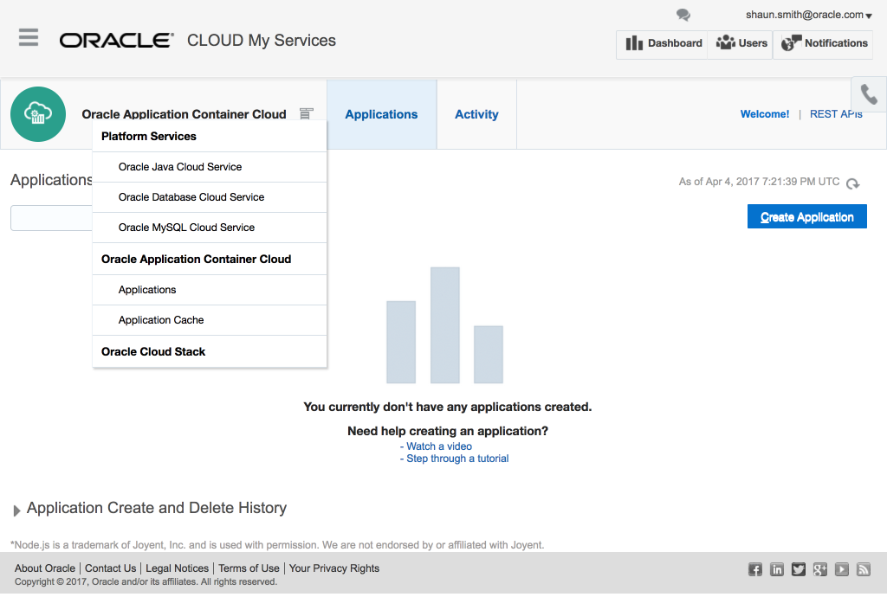
3. Navigate to `Templates` on the navigation bar.  You may see some predefined stack templates.
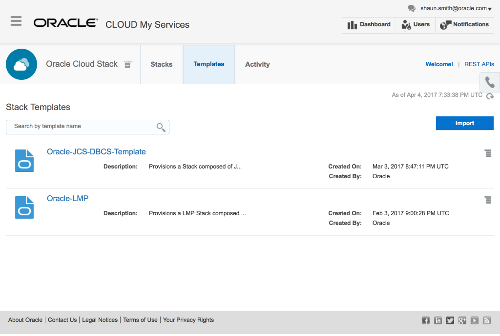
4. Click `Import` and select the `microservices-example.yaml` file.
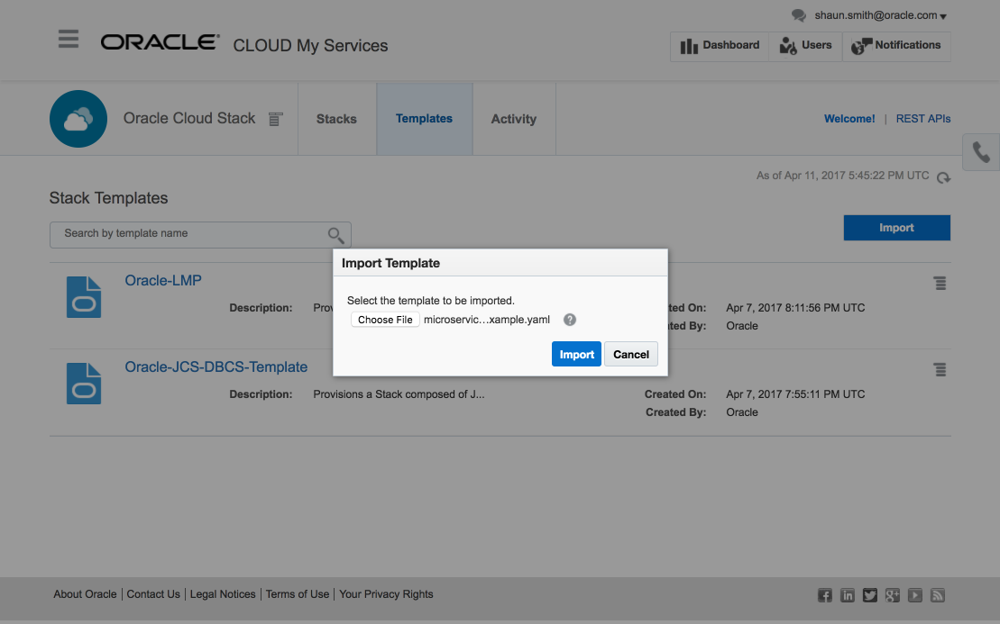
5. Once the import is complete you should see the imported template in the list.
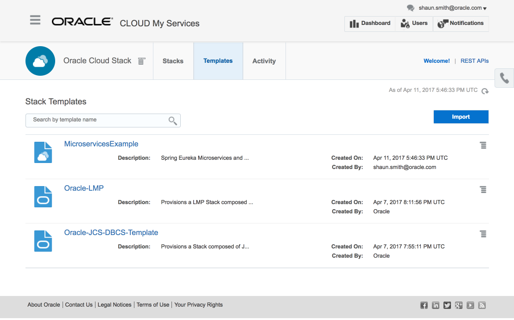

Uploading the Application Archive to Storage
--------------------------------------------

When using a stack template with ACCS, you need to first upload any application archives you might be deploying up to the [Oracle Storage Cloud](https://cloud.oracle.com/en_US/storage).  All three of the applications are contained in the single fat jar the Maven build packaged into an application archive named `microservices-example-dist.zip`.  The template has a parameter for the storage location of this archive file that defaults to `microservices-example/microservices-example-dist.zip` so we need to upload the zip to the `microservices-example` storage container.  The first step (using basic auth) is to create the container, substituting your user id, password, and Oracle Cloud identity domain into:

    curl -X PUT -u <user id>:<password> https://<identity domain>.storage.oraclecloud.com/v1/Storage-<identity domain>/microservices-example

Once we have a `microservices-example` container we can upload the application archive into it (again substituting your credentials):

    curl -X PUT -u <user id>:<password> https://<identity domain>.storage.oraclecloud.com/v1/Storage-<identity domain>/microservices-example/microservices-example-dist.zip -T target/microservices-example-dist.zip

You can confirm the application archive is successfully uploaded by getting the contents of the container:

    curl -X GET -u <user id>:<password> https://<identity domain>.storage.oraclecloud.com/v1/Storage-<identity domain>/microservices-example

Creating the Stack
------------------

With the code successfully staged in Storage Cloud, you can create the three services defined in the template simply choose `Create` from the stack template menu.

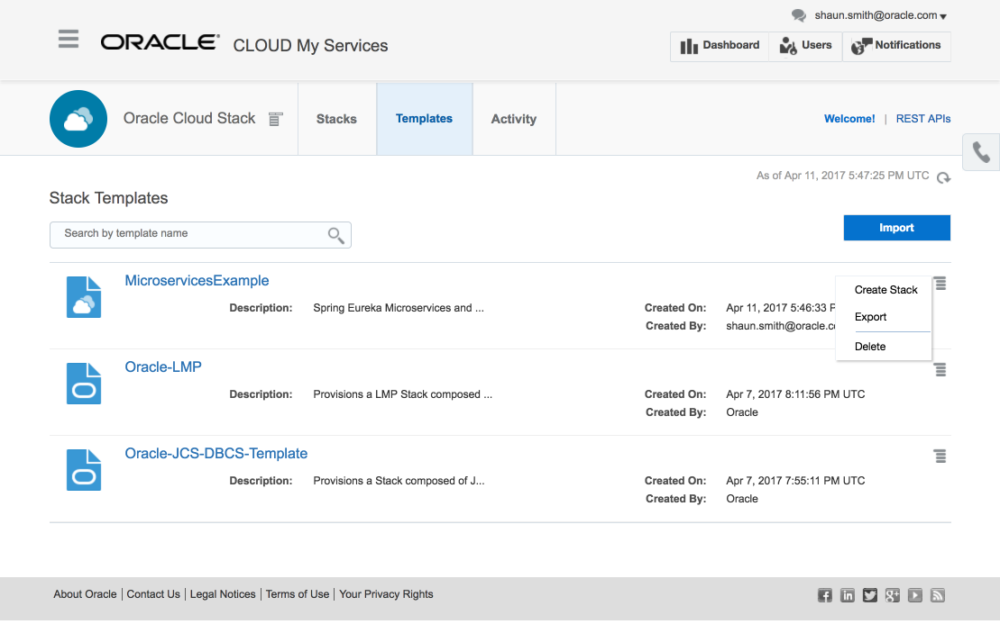

When the creation wizard opens, set the stack name to "MicroservicesExample" and click Next to accept the template defaults and then click Confirm on the next page.

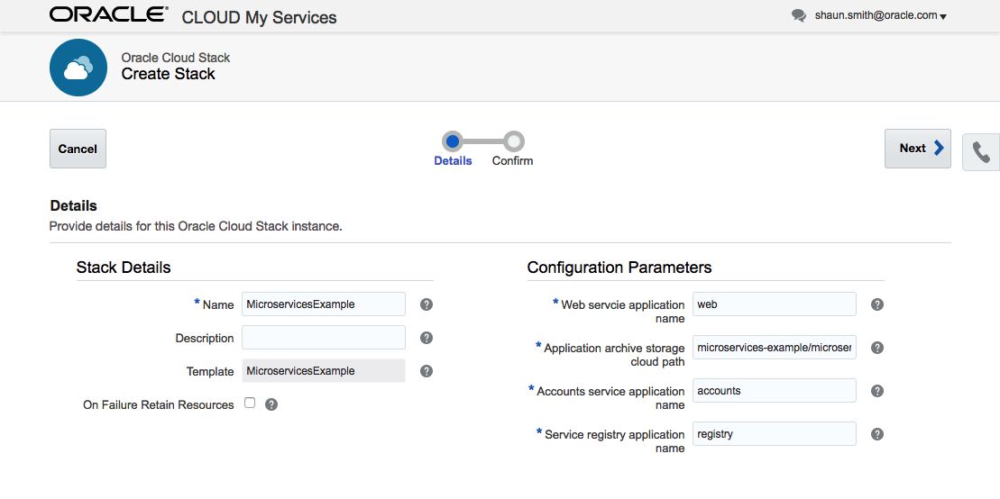

This will initiate a sequence of application creations based on the dependencies defined in the stack template.  If you click on the stack template name a window will open with a pictorial representation of the resources in the template and their dependencies.  From this diagram you can see that both `accounts` and `web` resources depend on `registry` so `registry` will be created first followed by the other two.

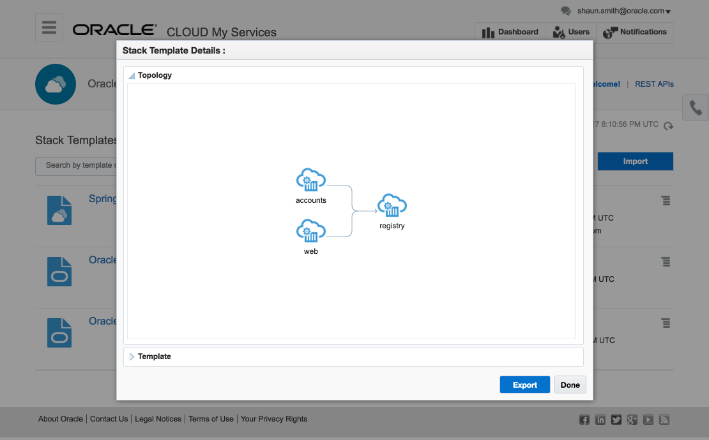

While the ACCS stack resources are being created you can monitor progress in the Stack Manager service console.  You can also see the applications as they are being created in the Application Container Cloud service console but you can't see the overall progress of the stack creation.

Click on Stacks in the navigation bar and then click on the MicroservicesExample stack to see the resources and their status.

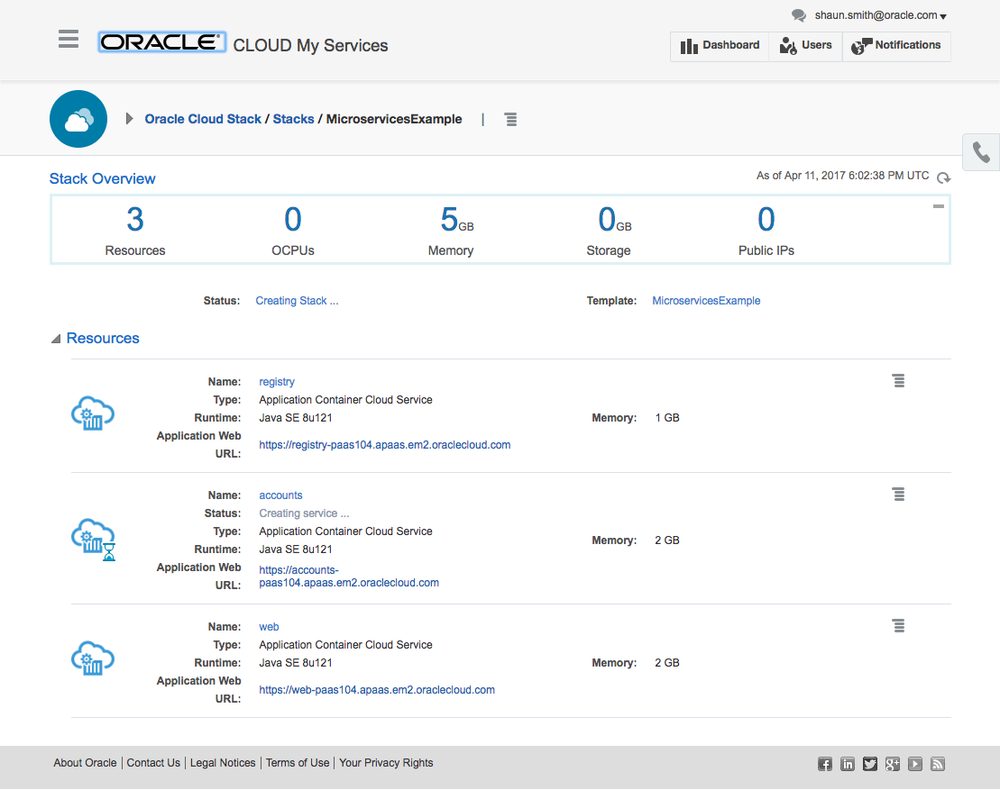

When all three applications are created they will be listed on the Application Container Cloud service console where you can manage their configuration, scale them out/in, obtain logs, etc.

Exploring the Microservices Example
===================================

Service Registry
----------------

Let's start with the Eureka service registry.  Navigate to the ACCS service console, locate the `registry` application and click on its URL.

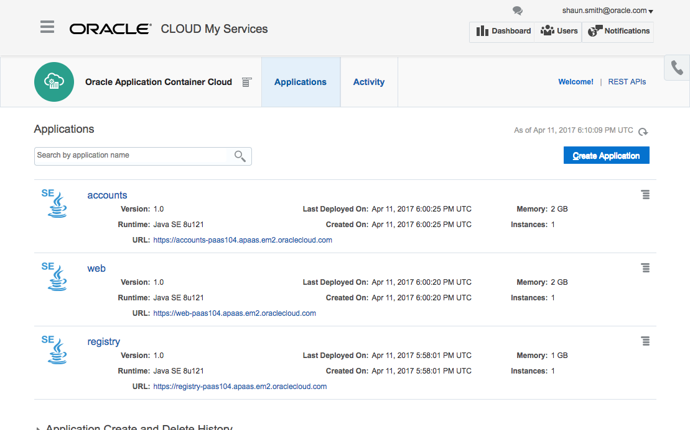

The Spring Eureka web console will open up in a new tab or window.  Under the "Instances currently registered with Eureka" heading you'll see a table with two applications: `ACCOUNTS-SERVICE` and `WEB-SERVICE`.  These are the logical names that actual services register under.  On the right are service (ACCS application) instances that have registered under those Application names.  In the following diagram you can see one 	`accounts` and one `web` application.  Their names are composed of their application name and a unique instance id.

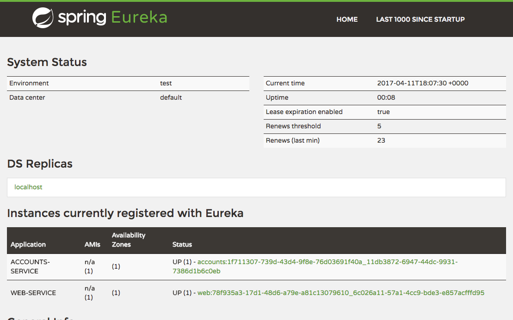

When each of the two application instances started up they automatically registered themselves with the service registry communicating via the internal overlay network.

If you scale out the `web` application to two instances the second instance will also automatically registry with the service registry and appear in the web console's list of `WEB-SERVICE` instances.

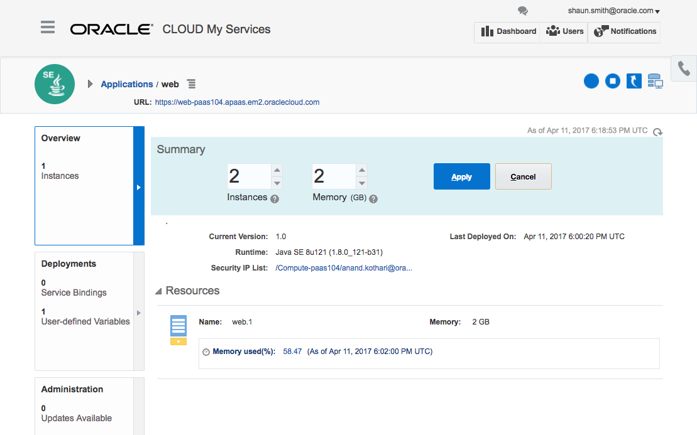

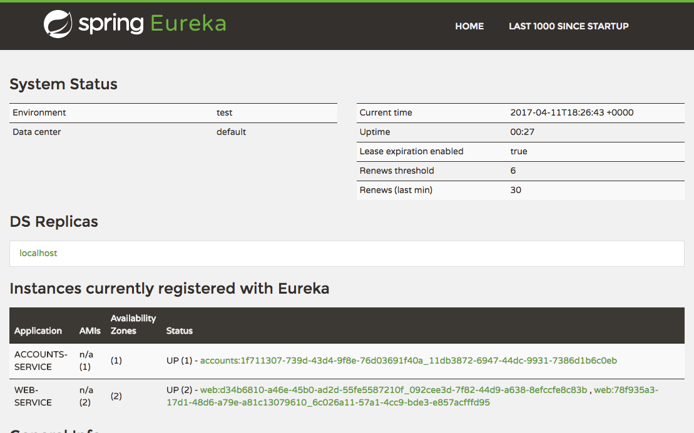

Web and Accounts Applications
-----------------------------

With an `accounts` application registered with the service registry, the `web` application is ready to use.  If you open the `web` application URL you're presented with a simple UI that allows you to query account info.

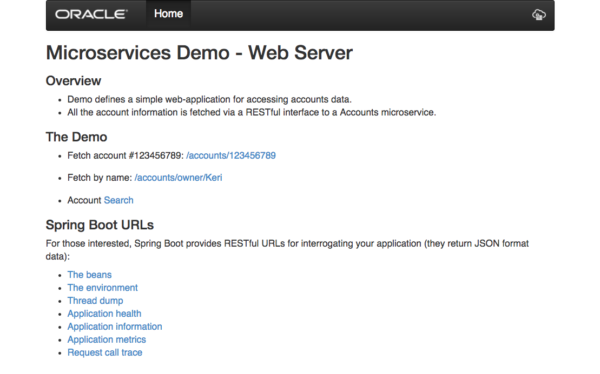

All requests for data are sent to an available `accounts` application instance.  For each user requests for data, the `web` application queries the service registry for the URL of an `accounts` application.  It then makes calls to the `accounts` application for the required data.  Click on the link `/accounts/123456789` to fetch the account details.

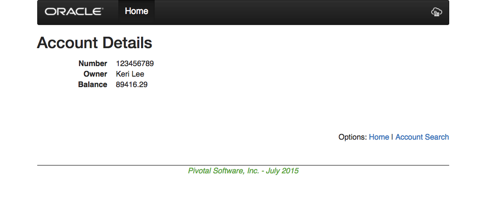

Using this service registry lookup approach it's possible to add and remove services by either scaling up and down or by deploying new versions and the client applications are able to find and receive service from whatever is available.  The  [original Spring Cloud Eureka example](https://spring.io/blog/2015/07/14/microservices-with-spring) this example is based on provides details on the code required to perform both the registration and lookup.

Conclusion
----------

There you have it--a Spring Cloud microservices example using Eureka as a service registry all running on Oracle Application Container Cloud communicating over an internal overlay network.  This example kind of got out of hand with the detour into the use of Stack Manager but I think this approach provides a very easy way to deploy sets of related services. ;)

